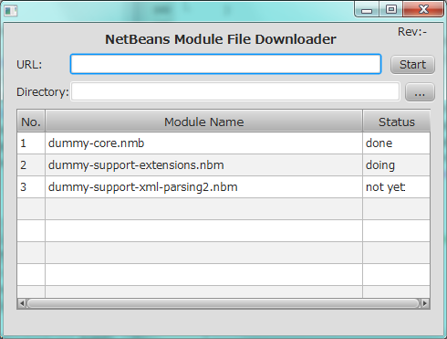

nbmdownloader
=============

This program downloads NetBeans IDE's plugin module files from updatecenter URL.

System Requirement
------------------

- Java SE 7 Update6 or newer (JavaFX 2 needed)

Build
-----
- NetBeans IDE 7.2 or newer.
  - Open project and build by NetBeans IDE.

Run
---

- Start from NetBeans IDE.
- Or, launch the builded jar file (JavaFX standalone jar).

Usage
-----

- Input updatecenter's URL of NetBeans plugin.
- Input or select directory for the place of saving download files.
- Then, click start button.

Restriction
-----------

- On startup, a dummy list is shown
- No checking downloaded file size
- No support for updatecenter xml chain

Release note
------------

LICENES
-------

BSD 2-Clause License

Screenshots
-----------

